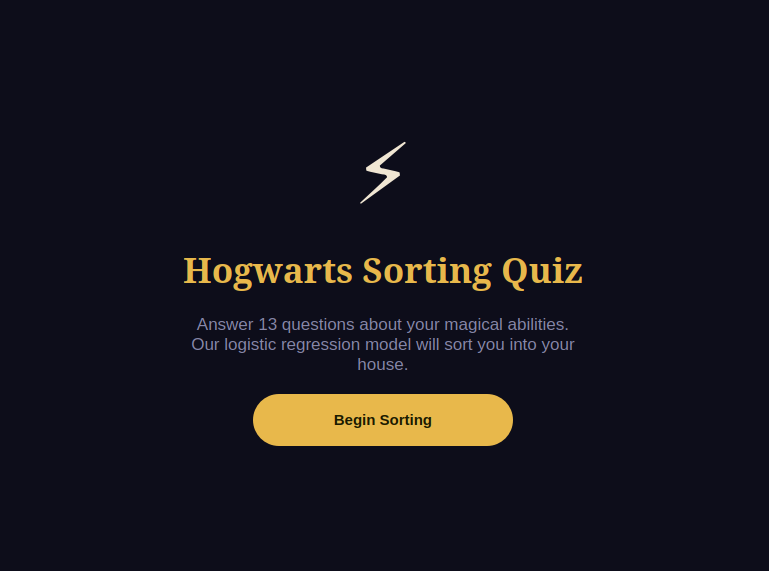
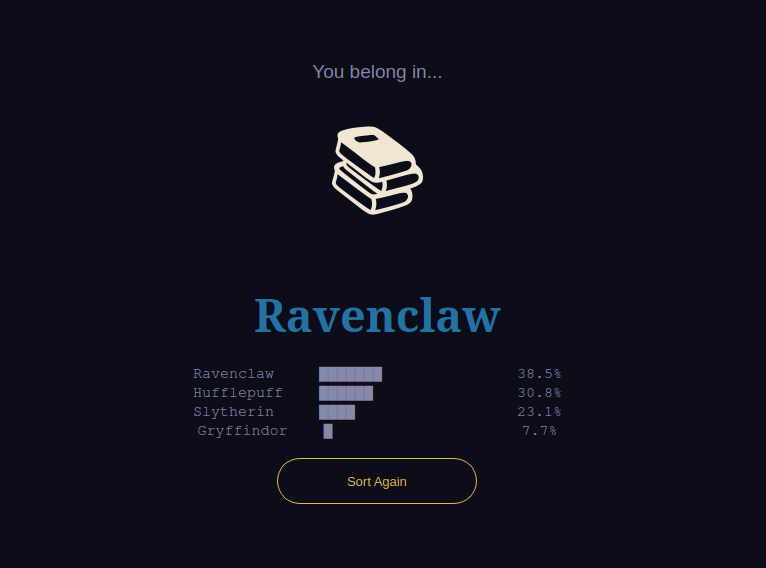

# 🧙 DSLR — Data Science × Logistic Regression

A **logistic regression classifier** built from scratch that sorts Hogwarts students into their houses. Implements gradient descent, data visualization, and statistical analysis without relying on high-level ML libraries.


---

<div align="center">
  
</div>

---

## 📋 Table of Contents

- [Features](#-features)
- [How It Works](#-how-it-works)
- [Project Structure](#-project-structure)
- [Setup](#-setup)
- [Usage](#-usage)
- [Bonus](#-bonus)

---

## ✨ Features

- **Statistical analysis** — Computes count, mean, std, variance, min/max, quartiles, IQR, skewness and kurtosis from scratch (no library functions)
- **Data visualization** — Histogram, scatter plot and pair plot to explore and understand the dataset
- **Logistic regression** — One-vs-all multi-class classifier with sigmoid activation and cross-entropy loss
- **Gradient descent** — Batch, stochastic (SGD) and mini-batch implementations
- **Z-score normalization** — Features normalized using training statistics, applied consistently at prediction time
- **NaN handling** — Missing values imputed with per-feature means before training
- **≥ 98% accuracy** — Validated against the 42 evaluation script

---

## 🧠 How It Works

### Logistic Regression

The classifier uses the **sigmoid function** to map a linear combination of features to a probability:

```
h(x) = 1 / (1 + e^(-θᵀx))
```

The model is trained by minimizing the **cross-entropy loss**:

```
J(θ) = -(1/m) Σ [ y·log(h(x)) + (1-y)·log(1-h(x)) ]
```

The gradient update rule at each step is:

```
θ := θ - α · (1/m) · Xᵀ(h(X) - y)
```

### One-vs-All (OvA)

Since there are 4 houses, we train **4 independent binary classifiers** — one per house. Each classifier learns to distinguish its house from all others. At prediction time, the house with the highest sigmoid score wins.

### Preprocessing Pipeline

```
Raw CSV  →  NaN imputation (column means)  →  Z-score normalization  →  Training
```

The normalization parameters (means and stds) are saved alongside the weights and reused at prediction time so the test data is transformed identically.

### Feature Selection

The pair plot reveals that **Astronomy** and **Defense Against the Dark Arts** have a perfect negative correlation (r ≈ −1.00), meaning they carry identical information. The scatter plot confirms this visually. Both are kept in the model since logistic regression handles collinearity, but the redundancy is noted.

---

## 📁 Project Structure

```
dslr/
├── src/
│   ├── describe.py         # Statistical descriptors (no library functions)
│   ├── histogram.py        # Score distribution per house
│   ├── pair_plot.py        # Full feature scatter matrix
│   ├── scatter_plot.py     # Focused scatter between two features
│   ├── logreg_train.py     # Training + weights output
│   └── logreg_predict.py   # Prediction + houses.csv output
├── data/
│   ├── dataset_train.csv   # 1600 students, 13 numerical features
│   └── dataset_test.csv    # 400 students (no labels)
├── docs/
│   ├── subject.txt
│   └── eval_sheet.txt
├── requirements.txt
└── README.md
```

---

## 📦 Setup

```bash
python3 -m venv venv
source venv/bin/activate
pip install -r requirements.txt
```

---

## 🔨 Usage

**1. Data analysis**

```bash
python3 src/describe.py data/dataset_train.csv
```

Displays 13 statistics for every numerical feature: `Count`, `Mean`, `Std`, `Variance`, `Min`, `25%`, `50%`, `75%`, `Max`, `Range`, `IQR`, `Skewness`, `Kurtosis`.

---

**2. Histogram**

```bash
python3 src/histogram.py data/dataset_train.csv
```

Overlapping histograms for all 13 courses, coloured by house. Answers: *which course has a homogeneous score distribution across all four houses?*

> **Answer: Arithmancy** — the four houses overlap almost perfectly.

---

**3. Pair plot**

```bash
python3 src/pair_plot.py data/dataset_train.csv
```

13×13 scatter matrix. Diagonal shows per-house histograms; off-diagonal shows feature relationships coloured by house. Use this to identify redundant features and features that discriminate well between houses. Also saves `pair_plot.png`.

---

**4. Scatter plot**

```bash
# Default: Astronomy vs Defense Against the Dark Arts
python3 src/scatter_plot.py data/dataset_train.csv

# Custom pair
python3 src/scatter_plot.py data/dataset_train.csv "History of Magic" "Transfiguration"
```

Zooms in on a specific feature pair. Answers: *what are the two most similar features?*

> **Answer: Astronomy and Defense Against the Dark Arts** — correlation r ≈ −1.00, a perfect linear relationship visible in the pair plot.

---

**5. Train**

```bash
python3 src/logreg_train.py data/dataset_train.csv
```

Trains 4 binary classifiers (one per house) using batch gradient descent. Saves `weights.json` with the trained parameters and normalization values.

| Flag | Description | Default |
|---|---|---|
| `--optimizer` | `batch` / `sgd` / `mini-batch` | `batch` |
| `--lr` | Learning rate | `0.1` |
| `--epochs` | Number of epochs | `1000` |
| `--batch-size` | Mini-batch size (`mini-batch` only) | `32` |
| `--output` | Output file path | `weights.json` |

---

**6. Predict**

```bash
python3 src/logreg_predict.py data/dataset_test.csv weights.json
```

Applies the trained model to the test set and generates `houses.csv`:

```
Index,Hogwarts House
0,Gryffindor
1,Hufflepuff
...
```

---

**7. Evaluate**

```bash
python3 evaluate.py houses.csv data/dataset_truth.csv
```

The classifier must reach a minimum accuracy of **98%**.

---

## 🧙 Sorting Hat Quiz

An interactive GUI quiz that uses the trained model in real time.

```bash
# Train first, then launch the quiz
python3 src/logreg_train.py data/dataset_train.csv
python3 src/quiz.py
```

A language selection screen lets you choose **English** or **Spanish** before starting. Answer 13 questions about your magical abilities — one per subject. Each answer aligns with the characteristic performance level of one house in that subject. The Sorting Hat reveals your house with a confidence breakdown for all four.

<div align="center">
  
  
</div>

---

## 🎓 Bonus

The three gradient descent variants can be compared directly:

```bash
# Batch GD — full dataset per update, stable convergence
python3 src/logreg_train.py data/dataset_train.csv --optimizer batch

# Stochastic GD — one sample per update, noisier but faster per epoch
python3 src/logreg_train.py data/dataset_train.csv --optimizer sgd --lr 0.01 --epochs 100

# Mini-batch GD — best of both worlds
python3 src/logreg_train.py data/dataset_train.csv --optimizer mini-batch --batch-size 32
```

All three converge to the same accuracy on this dataset. `describe.py` also includes bonus statistics beyond the mandatory 8: `Variance`, `Range`, `IQR`, `Skewness` and `Kurtosis`.

---

<div align="center">
  Created by <a href="https://github.com/Flingocho">Flingocho</a>
</div>
